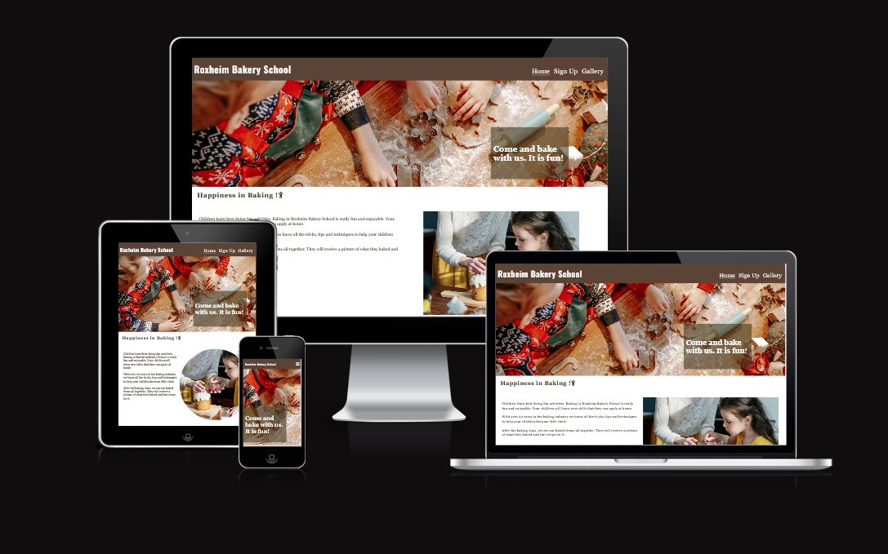
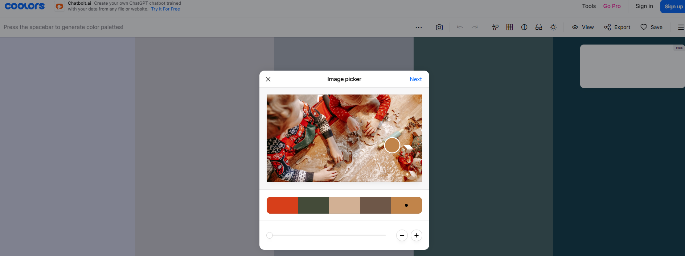

# Roxheim Bakery School - Website

# Introduction

Project 1 for Code Institute Full-stack development program: HTML/CSS Essentials

This Front End website is for a baking school in a small village in Roxheim. With a business online presence the small business hopes to acquire a larger audience and clientel. The website is interactive and user-friendly allowing the user to interact with the school through a contact form and social media channels.

[Live Website Here](https://angelaanjorin.github.io/Roxheim-Baking-School/)

# User Experience - UX

## User Stories

* As a front end website creator, I want to:

1. Build a website that is attractive visually to the user, to make them explore the website and potentially become clients of the business.
2. Build a user friendly website to make it easy for the user to navigate.

* As a new visitor, I want to:

1. Understand the main purpose of the website.
2. Be able to easily navigate the site to get all relevant information that i need.
3. Be able to easily contact the business and signup for bakery classes.

## Design

### Website Structure

The Roxheim Bakery School website is a four page site: Home Page, Signup Page, Thank you Page and Gallery Page. The Home Page has five sections, (1) Header, (2) Xmas, (3) Intro, (4) Classes, (5) Footer with Social Networks links. The Home Page is linked to all the other pages through the Navigation Menu at the top right part of the header. The Home Page has also a link within the Class section to the Signup Page. The Signup Page and Gallery Page have also the same Navigation Menu and a link to the Home Page through the Logo.

### Color Scheme

There are four main colors used: (1) White (#ffffff), (2) Beaver (#B58B6Eff), (3) drab-dark-brown (#463B24ff), (4) raisin-black (#1F181Fff). The last color used as a default font color. The background is white and sinopia (#D43F17ff) is used as a highlighter on very large screen devices for the hover effect on the signup page.

### Typography

* The Oswald, sans-serif is used for the Headings.
* The default font set by the style.sheet is Georgia, 'Times New Roman', Times, serif used for the test.

### Imagery
* 3 background images, one as the first section of the Home Page, the other used in the class section of the Home Page and the last used on the Signup Page.
* 1 image for the intro section of the Home Page.
* 1 image for the thank you Page.
* 12 images for the Gallery Page.
* Note: all images were converted to the webp files using two free converting websites; https://www.freeconvert.com/de/webp-converter and

https://convertio.co/

### Interactive Links

* In the footer, users can access the school´s social media links (Facebook, Twitter, Youtube and Instagram). Once the icons for the social media links are clicked, the user is directed to a new tab with the respective sites. 
* There is an internal link in the class section of the Home Page, directing the user to the Signup Page to sign up for the classes.

## Features

### Home Page 

### Navigation Menu
#### Mobile
#### Tablet
#### Desktop
### Welcoming Christmas Baking Picture
### Introduction Section
#### Mobile
#### Tablet
#### Desktop
### Class Section
#### Mobile
#### Tablet
#### Desktop
### Footer Section
### Signup Page
#### Larger Desktops
### Thankyou Page
### Gallery Page

