# Roxheim Bakery School - Website

# Introduction

Project 1 for Code Institute Full-stack development program: HTML/CSS Essentials

This Front End website is for a baking school in a small village in Roxheim. With a business online presence the small business hopes to acquire a larger audience and clientel. The website is interactive and user-friendly allowing the user to interact with the school through a contact form and social media channels.

[Live Website Here](https://angelaanjorin.github.io/Roxheim-Baking-School/)

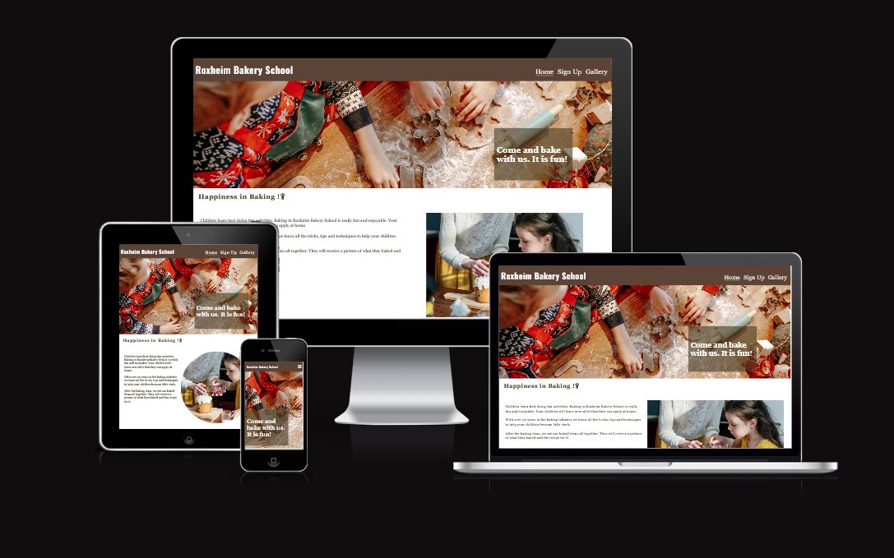

# User Experience - UX

## User Stories

* As a front end website creator, I want to:

1. Build a website that is attractive visually to the user, to make them explore the website and potentially become clients of the business.
2. Build a user friendly website to make it easy for the user to navigate.

* As a new visitor, I want to:

1. Understand the main purpose of the website.
2. Be able to easily navigate the site to get all relevant information that i need.
3. Be able to easily contact the business and signup for bakery classes.

## Design

### Website Structure

The Roxheim Bakery School website is a four page site: Home Page, Signup Page, Thank you Page and Gallery Page. The Home Page has five sections, (1) Header, (2) Xmas, (3) Intro, (4) Classes, (5) Footer with Social Networks links. The Home Page is linked to all the other pages through the Navigation Menu at the top right part of the header. The Home Page has also a link within the Class section to the Signup Page. The Signup Page and Gallery Page have also the same Navigation Menu and a link to the Home Page through the Logo.

### Color Scheme

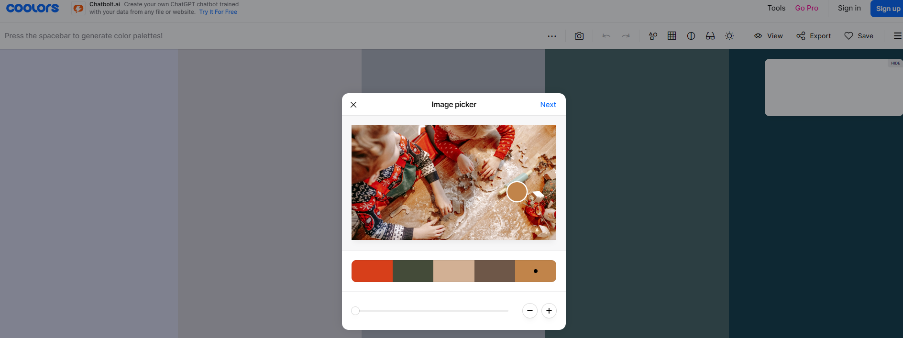
There are four main colors used: (1) White (#ffffff), (2) brown-derby (#5b4435) (3)sinopi (#D43F17ff) (4) drab-dark-brown (#463B24ff). The last color is used as a default font color. The background is white and sinopi (#D43F17ff) is used as a highlighter on very large screen devices for the hover effect on the signup page.

### Typography

* The Oswald, sans-serif is used for the Headings.
* The default font set by the style.sheet is Georgia, 'Times New Roman', Times, serif used for the test.

### Imagery
* 3 background images, one as the first section of the Home Page, the other used in the class section of the Home Page and the last used on the Signup Page.
* 1 image for the intro section of the Home Page.
* 1 image for the thank you Page.
* 12 images for the Gallery Page.
* Note: all images were converted to the webp files.

### Interactive Links

* In the footer, users can access the school´s social media links (Facebook, Twitter, Youtube and Instagram). Once the icons for the social media links are clicked, the user is directed to a new tab with the respective sites. 
* There is an internal link in the class section of the Home Page, directing the user to the Signup Page to sign up for the classes.

## Features

### Home Page 

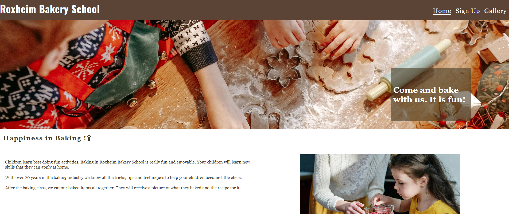
* The Home Page is the first page of the site that users get in contact with. It has an appealing big image of children´s hands baking cookies for christmas. The aim is for the user to have an emotional connection to baking at christmas time which should ret
[Live Homepage Here](https://angelaanjorin.github.io/Roxheim-Baking-School/index.html)

### Navigation Menu
* In the header on the right hand side users can find the navigation menu. It is fully responsive on all devices. The Navigation Menu has the links to the different pages of the site.

#### Mobile
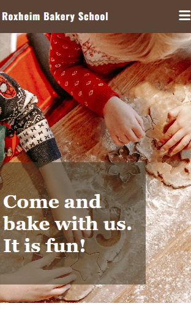
* The Navigation Menu is closed and represented by a burger sign on mobile devices. 

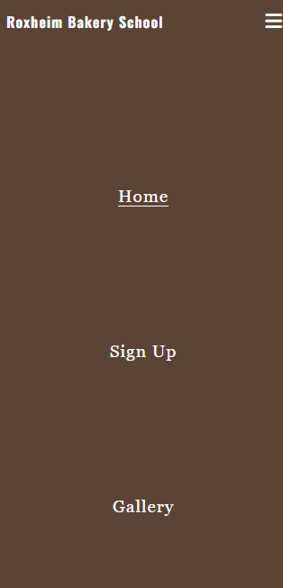
* When the burger icon is toggled on the mobile devices it fully opens with the links to the other pages.

#### Tablet
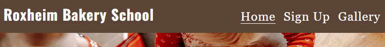

*The Navigation Menu shows as a horizontal list on the right hand side of the Header on Tablets.

### Welcoming Christmas Baking Picture

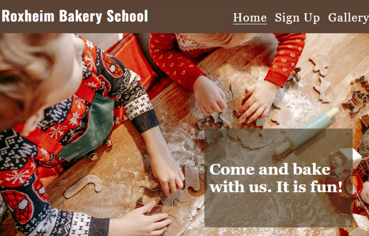

* A nice warm welcoming picture of children baking christmas cookies should have the effect of attracting the user and retaining thier interest. An inviting text accompanies the image.

### Introduction Section

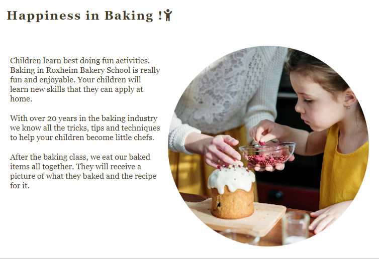
* This section should give the user some information about the Roxheim Bakery School and what benefits they should expect when they join a baking class. It is responsive on the different devices.

#### Mobile
#### Tablet
#### Desktop
### Class Section

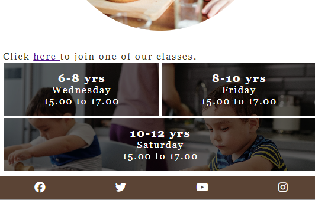
* The aim of the section is to provide the user with the information about the different classes with a link to refer them to the signup Page.
#### Mobile
#### Tablet
#### Desktop
### Footer Section

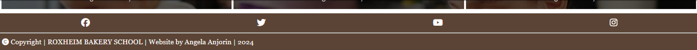
This section gives the links to all the social network sites for the school, to give the user more information about the school.

### Signup Page

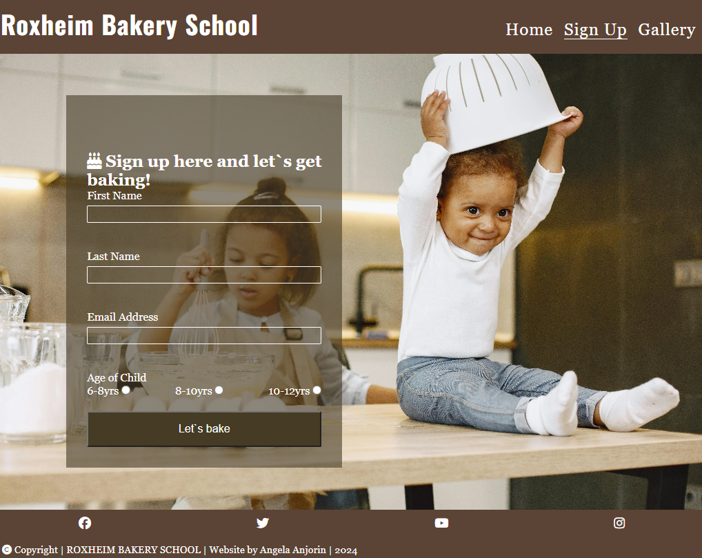

* In this section the users are given the opportunity to signup for a course.

#### Larger Desktops
 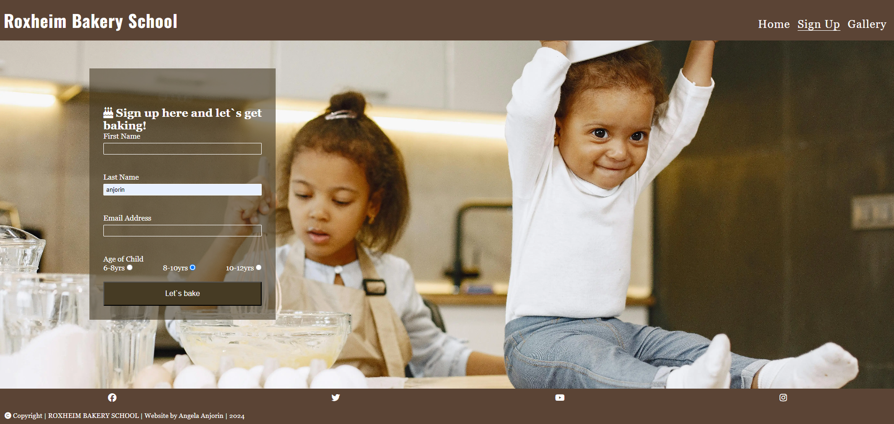
 * Here  on larger devices the hover feature is used to engage the user more and encourage them to signup for a class.
[Live Feature Here](https://angelaanjorin.github.io/Roxheim-Baking-School/signup.html)

### Thankyou Page

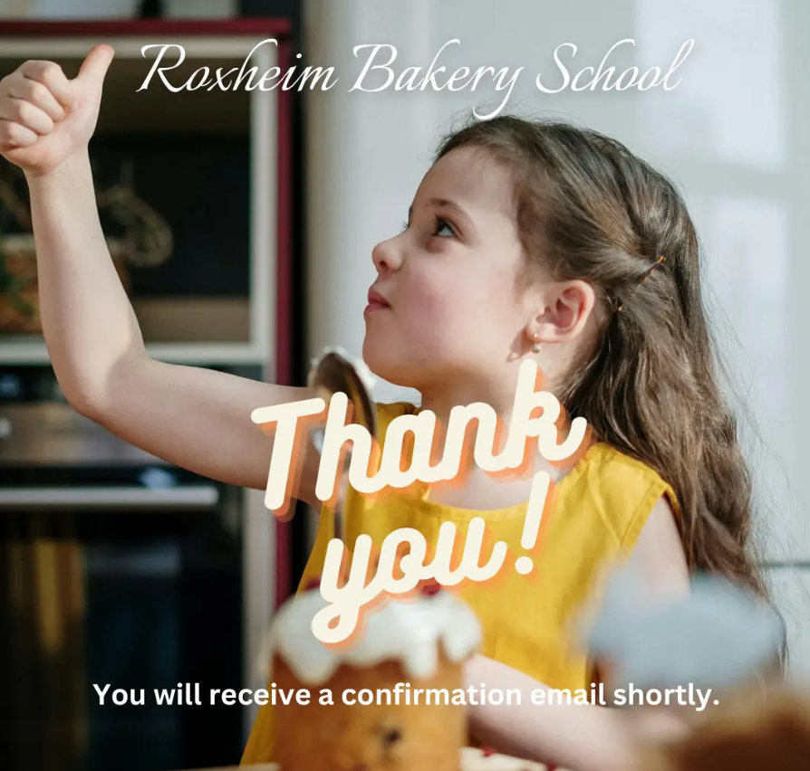
* This page pops up when the user has correctly signed up for a course. It is a thank you message with the added information that they will receive a confirmation email shortly.

### Gallery Page

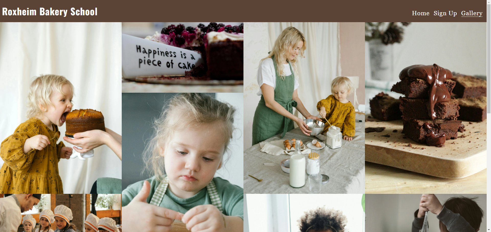
* This section gives the user a gallery of images about the activites at the Roxheim Bakery School, showing the children having fun baking. It show cases some of the baked products and the children eating them and enjoying themselves. It is a visual form of a review section. 
[Live Gallery Page](https://angelaanjorin.github.io/Roxheim-Baking-School/gallery.html)

## Future Features

### Customer Review Section
### Shop Section
### About me Section

## Technolgies Used
### Languages Used
### Frameworks - Libraries - Programs Used
https://www.freeconvert.com/de/webp-converter
https://convertio.co/
## Testing
