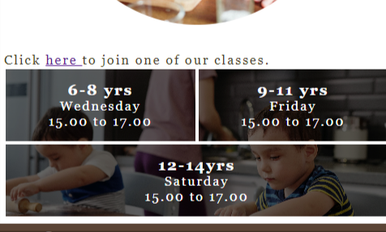
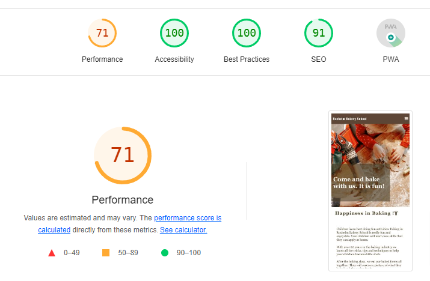

# Roxheim Bakery School - Website

# Introduction

Project 1 for Code Institute Full-stack development program: HTML/CSS Essentials

This Front End website is for a fictional baking school in a small village in Roxheim, Germany. With a business online presence, the small business hopes to acquire a larger audience and clientel. The website is interactive and user-friendly allowing the user to interact with the school through a contact form and social media channels.

[Live Website Here](https://angelaanjorin.github.io/Roxheim-Baking-School/)

- [Roxheim Bakery School - Website](#roxheim-bakery-school-website)
- [Introduction](#introduction)
- [Site Goals:](#site-goals)
- [User Experience - UX](#user-experience-ux)
   * [User Stories](#user-stories)
         - [New User:  ](#new-user)
         - [Returning User:](#returning-user)
   * [Development Planes:](#development-planes)
   * [Strategy](#strategy)
      + [Roles: ](#roles)
      + [Demographic:](#demographic)
      + [Psychographic:](#psychographic)
         - [Lifestyle:](#lifestyle)
         - [Values:](#values)
         - [The website needs to allow users to:  ](#the-website-needs-to-allow-users-to)
         - [The website needs to allow the teacher at the school to:  ](#the-website-needs-to-allow-the-teacher-at-the-school-to)
   * [Scope:  ](#scope)
      + [Content Requirements:](#content-requirements)
      + [Functionality Requirements:](#functionality-requirements)
   * [Design](#design)
      + [Website Structure](#website-structure)
      + [Color Scheme](#color-scheme)
      + [Typography](#typography)
      + [Imagery](#imagery)
      + [Interactive Links](#interactive-links)
   * [Features](#features)
      + [Home Page ](#home-page)
      + [Navigation Menu](#navigation-menu)
         - [Mobile](#mobile)
         - [Tablet](#tablet)
      + [Welcoming Christmas Baking Picture](#welcoming-christmas-baking-picture)
      + [Introduction Section](#introduction-section)
      + [Class Section](#class-section)
      + [Footer Section](#footer-section)
      + [Signup Page](#signup-page)
         - [Larger Desktops](#larger-desktops)
      + [Thankyou Page](#thankyou-page)
      + [Gallery Page](#gallery-page)
   * [Future Features](#future-features)
      + [Customer Review Section](#customer-review-section)
      + [Shop Section](#shop-section)
      + [About me Section](#about-me-section)
   * [Technolgies Used](#technolgies-used)
      + [Languages Used](#languages-used)
      + [Frameworks - Libraries - Programs Used](#frameworks-libraries-programs-used)
   * [Testing](#testing)
   * [Deployment of This Project](#deployment-of-this-project)
   * [Credits](#credits)
      + [Information Sources/Resources](#information-sourcesresources)
   * [Content](#content)
      + [Images](#images)
   * [Special Thanks](#special-thanks)

# Site Goals:

The goals for this site are as follows:
* To provide information to users about bakery classes for children in Roxheim, Germany.
* Gain more demographic exposure.
* Gain more students to the school.
* Invite enquiries from parents with children interested in baking.

# User Experience - UX

## User Stories

#### New User:  
* As a new user, I am looking to find information regarding baking classes for children.  
* As a new user, I am looking to contact the school.   
* As a new user, I would like to see pictures of past students of the school.  

#### Returning User:
* As a returning user, I would like to see if there are any new class times added.
* As a returning user, I would like to see if any new class photos have been added.

## Development Planes:
To create a website that is comprehensive and informative for a user, as a developer you need to look at all aspects of the website and how someone who visits your website will use it. You have to consider all the user stories that have been outlined in the above sections.  

## Strategy
The strategy principal looks at user needs, as well product/service objectives. This websites target audience was broken down into three categories:

### Roles: 
* New User
* Existing User  

### Demographic:
* Parents of young children
* Grandparents of young children
* Resident in Roxheim, Germany 

### Psychographic:

#### Lifestyle:
* Enjoy eating delicious pastery  

#### Values:
* Teaching children life skills at a young age  

#### The website needs to allow users to:  
* View times of classes for their child's age group  
* View information about the school 

#### The website needs to allow the teacher at the school to:  
* Receive signups from parents/grandparents/guardians   
* Get contacted also through it´s social networks from site visitors through the various social network icons on the website  

## Scope:  

With the structure in place, it was then time to move onto the scope plane. This was all about developing website requirements based on the goals set out in the strategy plane. These requirements are broken down into two categories.

### Content Requirements:
1. The user will be looking for:
      * Information on class times 
      * Information on the bakery school
      * Techniques on how to make something they may not have done before

### Functionality Requirements:
1. The user will be able to:
      * Navigate through the site to find the information they need
      * Signup to the classes offered on the site.
      * Get more information through the icon links to the social networks of the school.

## Design

### Website Structure
The information above was then used to create a structure for the website. The Skeleton of the website was created on paper. 
The Roxheim Bakery School website is a four page site: Home Page, Signup Page, Thank you Page and Gallery Page. The Home Page has five sections, (1) Header, (2) Xmas, (3) Intro, (4) Classes, (5) Footer with Social Networks links. The Home Page is linked to all the other pages through the Navigation Menu at the top right part of the header. The Home Page has also a link within the Class section to the Signup Page. The Signup Page and Gallery Page have also the same Navigation Menu and a link to the Home Page through the Logo.

### Color Scheme

* The color scheme of the website was generated using [Coolors](https://coolors.co/) from the main picture on the Home Page. 
* There are four main colors used: (1) White (#ffffff), (2) brown-derby (#5b4435) (3)sinopi (#D43F17ff) (4) drab-dark-brown (#463B24ff). The last color is used as a default font color. The background is white and sinopi (#D43F17ff) is used as a highlighter on very large screen devices for the hover effect on the signup page.

### Typography

* The Oswald, sans-serif is used for the Headings.
* The default font set by the style.sheet is Georgia, 'Times New Roman', Times, serif used for the test.

### Imagery

* 3 background images, one as the first section of the Home Page, the other used in the class section of the Home Page and the last used on the Signup Page.
* 1 image for the intro section of the Home Page.
* 1 image for the thank you Page.
* 12 images for the Gallery Page.
* Note: all images were converted to the webp files.

### Interactive Links

* In the footer, users can access the school´s social media links (Facebook, Twitter, Youtube and Instagram). Once the icons for the social media links are clicked, the user is directed to a new tab with the respective sites. 
* There is an internal link in the class section of the Home Page, directing the user to the Signup Page to sign up for the classes.

## Features

### Home Page 

* The Home Page is the first page of the site that users get in contact with. It has an appealing big image of children´s hands baking cookies for christmas. The aim is for the user to have an emotional connection to baking at christmas time which should ret
[Live Homepage Here](https://angelaanjorin.github.io/Roxheim-Baking-School/index.html)

### Navigation Menu

* In the header on the right hand side users can find the navigation menu. It is fully responsive on all devices. The Navigation Menu has the links to the different pages of the site.

#### Mobile

* The Navigation Menu is closed and represented by a burger sign on mobile devices. 

* When the burger icon is toggled on the mobile devices it fully opens with the links to the other pages.

#### Tablet

*The Navigation Menu shows as a horizontal list on the right hand side of the Header on Tablets.

### Welcoming Christmas Baking Picture

* A nice warm welcoming picture of children baking christmas cookies should have the effect of attracting the user and retaining thier interest. An inviting text accompanies the image.

### Introduction Section

* This section should give the user some information about the Roxheim Bakery School and what benefits they should expect when they join a baking class. It is responsive on the different devices.

### Class Section

* The aim of the section is to provide the user with the information about the different classes with a link to refer them to the signup Page.

### Footer Section

This section gives the links to all the social network sites for the school, to give the user more information about the school.

### Signup Page

* In this section the users are given the opportunity to signup for a course.

#### Larger Desktops

 
 * Here  on larger devices the hover feature is used to engage the user more and encourage them to signup for a class.
[Live Feature Here](https://angelaanjorin.github.io/Roxheim-Baking-School/signup.html)

### Thankyou Page

* This page pops up when the user has correctly signed up for a course. It is a thank you message with the added information that they will receive a confirmation email shortly.

### Gallery Page

* This section gives the user a gallery of images about the activites at the Roxheim Bakery School, showing the children having fun baking. It show cases some of the baked products and the children eating them and enjoying themselves. It is a visual form of a review section. 
[Live Gallery Page](https://angelaanjorin.github.io/Roxheim-Baking-School/gallery.html)

## Future Features

### Customer Review Section

* If there is a Review Section with parents telling how thier children enjoyed the baking classes, this would help the user to gain confidence to signup for a class.

### Shop Section

* A shop can be used on many levels to generate extra money for the school, selling all kinds of things from recipies, baking utensils, baking aprons and gloves and hats for the children, recipe books etc. Selling digital courses for children who can´t come to the school either because they live too far or the days and times of the provides classes are just not convenient for the user. Older children and even adults can also benefit from the digital courses. 

### About me Section

* More infromation about the teacher of the Roxheim Bakery School would help the users to know more about the person behind the school building more trust.

## Technolgies Used

### Languages Used

* [HTML5](https://en.wikipedia.org/wiki/HTML5).
* [CSS3](https://en.wikipedia.org/wiki/Cascading_Style_Sheets).

### Frameworks - Libraries - Programs Used

* [Google Fonts:](https://fonts.google.com/)
   * Google fonts were used to import the 'Oswald' fonts throughout the style.css.
* [Font Awesome:](https://fontawesome.com/)
    * Icons for the burger Navigation Menu, the cake with candles, happy child and for the social networks were acquired from Font Awesome.
* [Git](https://git-scm.com/)
    * Git was used for version control by utilizing the Gitpod terminal to commit to Git and Push to GitHub.
* [GitHub:](https://github.com/)
    * GitHub is used to store the project's code after being pushed from Git.
* [GitHuv](https://derlin.github.io/bitdowntoc/)
    * This link was used to create the table of content for the README file.
* [Visual Studio Code](https://code.visualstudio.com/)
    *Visual studio code was used to write my code.
* [Freeconvert:](https://www.freeconvert.com/de/webp-converter)
* [Convertio:](https://convertio.co/)
    * These sites were used to modify and resize all images on this website.
* [Canva](https://www.canva.com/design/DAGA0N2eK2Y/s47LWlWuWGWSnfLPZoMWpQ/edit)
    * Canva was used to create the Thankyou image.
* [Coolors:](https://coolors.co/image-picker)
    * Coolors was used to generate a color pallete for the site based on the welcoming first image on the Home Page.

## Testing

The W3C Markup Validator and W3C CSS Validator Services were used to validate every page of the project to ensure there were no syntax errors in the project.

* [W3C Markup Validator](https://validator.w3.org/#validate_by_input) 
* [W3C CSS Validator](https://jigsaw.w3.org/css-validator/#validate_by_input)

Google Lighthouse was used to test Performance, Best Practices, Accessibility and SEO on both Desktop and Mobile devices.
The testing was done using the Google Chrome Browser. Testing was also done using Firefox on desktop.

  ## Functionality
* All links have been hovered and clicked to ensure accessibility.
* Pages all load correctly on all device screen sizes.
* All social media links work correctly and open on a new tab.
* All images load on each page as intended.
* All the buttons and links on the different pages are working correctly and bring the users to the function that they were built for.
* The button on the Signup Page and the sections to be filled out with the requested information change the border color when hovered by the user. They are working without issues.
* The filled out sections of the form change color when completed by the user correctly.

   ## Bugs

* I was unable to reduce the largest contenful paint element in <section id=xmas> and eliminate the render-blocking resources from Font Awesome as suggested by Google Lighthouse [Lighthouse Results here:](https://angelaanjorin.github.io/Roxheim-Baking-School/index.html)

   ## Website Development Issues

* At the initial stages of my project, I was using [codeanywhere ](https://codeanywhere.com/) with some difficulties until i was advised to use Visual Studio Code. 
* I changed some of the fonts and colors towards the end of the project to improve the user experience.

## Deployment of This Project

The website development was created in the "main" branch. This branch was deployed using GitHub Pages.

* This site was deployed by completing the following steps:

1. Open [GitHub](https://github.com/).
2. Click on the project to be deployed.
3. Navigate to the "Settings".
4. Navigate down to the "GitHub Pages".
5. Click on "Check it out here!".
6. Select the "main" branch and select "Save".
7. The link to the live website was ready on the top.

## Credits

### Information Sources/Resources

* [W3Schools](https://www.w3schools.com/).

* [Code Institute](https://stackoverflow.com/).
  

## Content

* All the text content is original. I got inspiration from the following the Love run Project and following Projects 1 from Code Institute
    1. [Love Running](https://code-institute-org.github.io/love-running-2.0/index.html)
    2. [Flawlesscooking by Martiless](https://martiless.github.io/flawlesscooking/)
    3. [Travel World by Pedro Cristo](https://pedrocristo.github.io/portfolio_project_1/index.html)

### Images

* [Pexels:](https://www.pexels.com/search/baking%20children/)
    *All the free images used on the site were gotten from Pexels.
  
## Special Thanks

 * Special thanks to my partner and alumni of Code Institute Eric Jones for his assistance throughout this project.